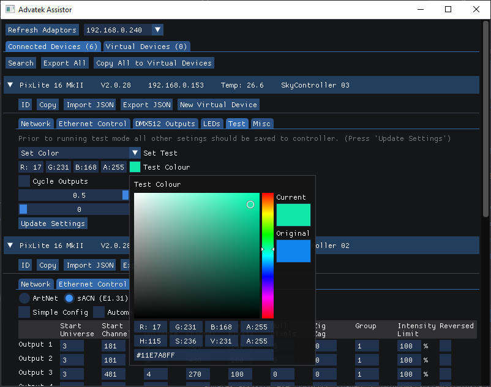

# Advatek Assisitor

## About

This is an Advatek Assistant clone that can run under Linux and adds the following features:

  - Works and tested on Debian variants (Raspberry Pi / Ubuntu)
  - Saving and Loading of Advatek config settings to and from the controller in JSON format
  - Cycling of output channels in test mode
  - Cycling of output pixels in test mode

## Dependencies

  - [GLFW](https://github.com/glfw/glfw)
  - [ImGui](https://github.com/ocornut/imgui) ([Interactive Manual](https://pthom.github.io/imgui_manual_online/manual/imgui_manual.html))  
  - [Boost](https://github.com/boostorg/boost)  
  - [Portable File Dialogs](https://github.com/samhocevar/portable-file-dialogs)  

## Download and Run

  1. Download and install the latest [release package](https://github.com/studioENESS/advatek_assistor/releases)
  2. run the executable:

    advatek_assistor

## Build
    
    git clone <this repo>
    git submodule update --init
    
    cd External/boost
    git submodule update --init

    ./bootstrap.sh or bootstrap.bat
    ./b2
    
    sudo apt-get install libglfw3-dev
    
    mkdir build && cd build
    
    cmake ../ 
    
    make -j6

 **For debugging on Raspberry Pi use GDB**

    cmake -DCMAKE_BUILD_TYPE=Debug ../
    
    make
    
    gdb ./advatek_assistor
    
## Creating Debian/Ubuntu .deb package

Copy appplication file to `advatek_assistor_<major version>.<minor version>-<package revision>_<architecture>/usr/local/bin`

    dpkg-deb --build advatek_assistor_<major version>.<minor version>-<package revision>_<architecture>

